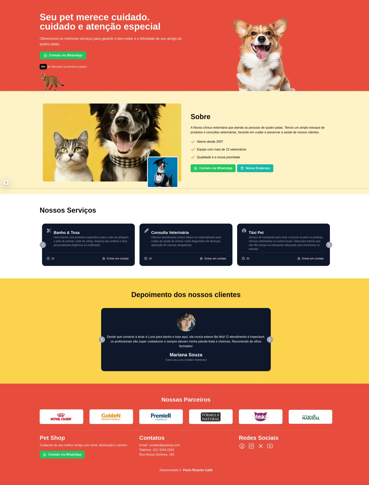

<h1 align="center" style="text-align: center;">
  📄 Pet Shop
</h1>

    

<h2 id="project">📁 Projeto</h2>

Desenvolvimento de uma landing page responsiva e interativa para um pet shop, utilizando Next.js como framework principal para garantir performance otimizada, renderização estática (SSG) e recursos de SEO integrados. A interface foi construída com Tailwind CSS, permitindo a criação de um design system consistente, utilitário-first e altamente personalizável, com foco em mobile-first e adaptação fluida a diferentes dispositivos.

Para engajamento visual, implementou-se o Embla Carousel como solução de carrossel modular - uma biblioteca leve (menos de 4kB) com gestos via touch/swipe, scroll suave e controle via API para exibição dinâmica de produtos e serviços. As animações scroll-triggered foram integradas através da biblioteca AOS (Animate On Scroll), criando transições fluidas (fades, slides, zooms) sincronizadas com a rolagem do usuário para uma experiência narrativa imersiva.

<h2 id="technologies">💻 Tecnologias</h2>

Este projeto foi desenvolvido com as seguintes tecnologias:

- Next
- React
- TailWind
- Embla Carrousel
- AOS
- Phosphor Icons
- Lucide Icons

<h2 id="site">⭐ Site</h2>

O site está disponível no seguinte endereço [aqui](https://landing-page-1wo6kr1p2-pcaldis-projects.vercel.app/).

## 👨🏻‍💻 Autor

<a href="https://github.com/pcaldi">
 
  
 <b>Paulo Caldi</b></a> <a href="https://github.com/pcaldi" title="emoji">🙋🏻</a>
  

---
